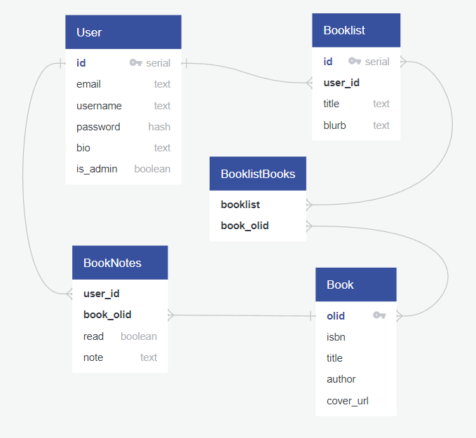

# Book Lists using [OpenLibrary.org](https://openlibrary.org/developers/api)

## What goal will your website be designed to achieve?

The Book List site will enable users to track books they have read and books they wish to read. If the books are in the public domain or available via OpenLibrary.org it will provide links for the users to access the book.

## What kind of users will visit your site? In other words, what is the demographic of your users?

The users of this site are people who enjoy reading books or want to read more books but need a place to keep track of the titles they are interested in reading or have already read.

## What data do you plan on using?

I intend to use [OpenLibrary.org](https://openlibrary.org/developers/api) to gather book data and determine which books are available in the public domain or to borrow.

If there is more time I would like to include links to Librivox.org audio books for public domain works.

## In brief, outline your approach to creating your project.

Answer questions like the ones below, but feel free to add more information:

### What does your database schema look like?

<!-- via [quickdatabasediagrams.com](quickdatabasediagrams.com) -->

### What kinds of issues might you run into with your API?

The API might not have every book available. Depending on the length of lists, there might performance issues with bulk requesting details on books in a list. This can be worked around by storing some book information in the database.

### Is there any sensitive information you need to secure?

The user's password will need to be secured.

### What functionality will your app include?

* CRUD User
* CRUD Booklist
* Search/Add/Remove book to list
* View book info
* Mark book as read
* Link to check out book
* Link to librivox (if exists)

### What will the user flow look like?

1. Create an account or Sign in
2. Search for books
3. Add one or more books to a list (possibly creating a new list)
4. Add notes to book lists or privately for their books

### What features make your site more than CRUD? Do you have any stretch goals?

Using the OpenLibrary.org api will allow the site to provide links to where the user can actually checkout the book legally.

My current stretch goal is to incorporate data from librivox.org for public domain works to link the users to freely available audio books.